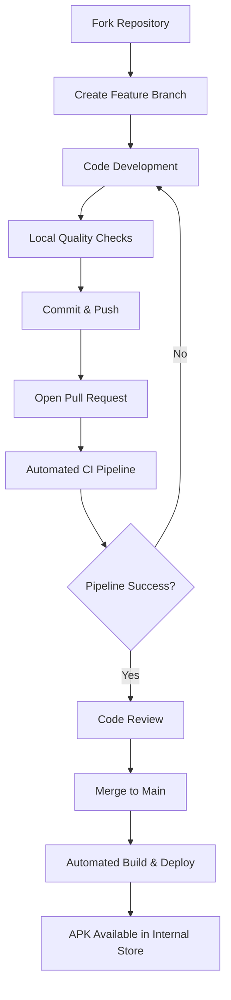

# Como Contribuir com o TaskManager

Ficamos felizes com seu interesse em contribuir! Este projeto segue padrões de desenvolvimento sênior com pipeline robusto de qualidade. Para manter a excelência técnica e a consistência do projeto, siga estas diretrizes.

## 🚀 Começando

1. **Faça um fork** do repositório
2. Clone seu fork: `git clone https://github.com/narradorww/TaskManager.git`
3. Siga as instruções de instalação no `README.md`
4. Crie uma nova branch para sua feature: `git checkout -b feat/minha-nova-feature`

## 🏗️ Pipeline de Desenvolvimento Sênior

### Fluxo de Desenvolvimento Completo


### Ambiente de Desenvolvimento
- **Node.js 20+** com cache de dependências
- **TypeScript strict mode** para máxima type safety
- **ESLint/Prettier** com configuração rigorosa
- **Husky pre-commit hooks** para validação automática

## 🏛️ Filosofia de Código e Arquitetura

Utilizamos uma **arquitetura híbrida sênior** para garantir escalabilidade e fácil manutenção em projetos enterprise:

### **Feature-Based Architecture**
- Organize o código por **domínio de negócio**, não por tipo técnico
- Tudo relacionado a tarefas fica em `src/features/tasks/`
- Cada feature é **autocontida** e pode ser desenvolvida independentemente
- Facilita trabalho em equipe e reduz conflitos de merge

### **Clean Architecture Principles**
- **Separação de responsabilidades** em camadas bem definidas
- **Dependency Inversion:** UI depende de abstrações, não de implementações
- **Business Logic isolada:** Reducers e useCases contêm toda a lógica de negócio
- **Componentes "burros":** UI apenas renderiza dados e dispara eventos

### **Atomic Design System**
- **Átomos (`atoms/`):** Componentes UI puros, testáveis e reutilizáveis (Button, Input, StatusCard)
- **Moléculas (`molecules/`):** Combinações funcionais de átomos (AddTaskForm, TaskItem)
- **Organismos:** Seções completas de telas que combinam moléculas
- **Consistência visual** e **escalabilidade** de componentes

## 🧪 Estratégia de Testes Multi-Camada

### **Pirâmide de Testes**
```
        🎭 E2E (Maestro)
       Testes de Fluxo Completo
           
    🧩 Integration Tests
   Testes de Componentes + Context
        
🔧 Unit Tests (Jest + Testing Library)
Testes de Lógica de Negócio + Componentes
```

### **Padrões de Teste**
- **Unit Tests:** Toda nova lógica em reducers, useCases e utilitários
- **Component Tests:** Renderização, props, eventos e acessibilidade
- **Integration Tests:** Componentes + Context para fluxos críticos
- **E2E Tests:** Fluxos principais do usuário com Maestro (usar seletores de texto)

### **Cobertura de Qualidade**
- **Minimum 80%** code coverage para novas features
- **100%** critical path coverage
- **Accessibility testing** com Testing Library

## ⚡ Pipeline CI/CD Automatizado

### **Validação Contínua (3 Etapas)**

#### **1. Quality Gate (validate)**
```bash
# Executado automaticamente em cada PR
✅ ESLint + Prettier (zero warnings)
✅ TypeScript strict check
✅ Jest unit tests + coverage
✅ Security audit
```

#### **2. E2E Validation (e2e-maestro)**
```bash
# Testes end-to-end automatizados
✅ Maestro flow testing
✅ Critical user journeys
✅ Cross-platform validation
```

#### **3. Production Build (build-android)**
```bash
# Build de produção otimizado
✅ Signed APK generation
✅ Bundle optimization
✅ AWS S3 deployment
✅ Versioned artifacts
```

### **📱 Internal Store Distribution**
APKs de cada build são automaticamente disponibilizados na **Internal Store**:
**🔗 [https://www.rodrigoalexandre.dev/internal-store](https://www.rodrigoalexandre.dev/internal-store)**

- **Builds versionados** por PR/commit
- **Download direto** para testing
- **Histórico completo** de releases
- **Metadata** de build e changelog

## ✅ Checklist de Qualidade Sênior

### **Antes de Committar**
```bash
# Quality checks obrigatórios
npm run lint          # Zero errors/warnings
npm run type-check     # Strict TypeScript validation  
npm test              # All tests passing
npm run test:coverage # Minimum 80% coverage
```

### **Antes do Pull Request**
```bash
# End-to-end validation
npm run test:e2e      # Maestro critical flows
npm run build         # Production build success
```

### **Code Review Standards**
- **Performance:** Evite re-renders desnecessários, otimize listas grandes
- **Accessibility:** Todos os componentes devem ser acessíveis (screenReader, contrast)
- **Security:** Validação de inputs, sanitização de dados
- **Scalability:** Código preparado para crescimento da aplicação

## 🔄 Pull Request Excellence

### **Conventional Commits Pattern**
```bash
feat(tasks): add task prioritization system
fix(ui): resolve iOS status bar overlap issue  
test(e2e): add task completion flow validation
docs(readme): update installation instructions
```

### **PR Template Sênior**
```markdown
## 🎯 Feature Overview
[Descrição clara do que foi implementado]

## 🏗️ Technical Approach  
[Decisões arquiteturais e padrões utilizados]

## 🧪 Test Coverage
- [ ] Unit tests added/updated
- [ ] Component tests added/updated  
- [ ] E2E flow tested
- [ ] Coverage threshold maintained

## 📱 Visual Changes
[Screenshots/GIFs para mudanças de UI]

## ⚡ Performance Impact
[Análise de performance se aplicável]

## 🔍 Review Checklist
- [ ] Code follows architectural patterns
- [ ] All CI checks passing
- [ ] Documentation updated
- [ ] Breaking changes documented
```

### **Review Process**
1. **Automated Pipeline** deve passar 100%
2. **Peer Review** por desenvolvedor sênior
3. **APK Testing** via Internal Store
4. **Approval** + Merge to main
5. **Automatic deployment** para Internal Store

## 🚀 Advanced Development Patterns

### **State Management**
- Use **Context + Reducer** para lógica complexa
- **Custom hooks** para reutilização de lógica
- **Memoização** para otimização de performance

### **Component Patterns**
- **Compound Components** para APIs flexíveis
- **Render Props** para lógica reutilizável
- **Forward Refs** para componentes de baixo nível

### **Performance Optimization**
- **React.memo** para componentes puros
- **useMemo/useCallback** para valores computados
- **FlatList** para listas grandes
- **Bundle splitting** para features opcionais


## 📞 Suporte e Dúvidas

- **Issues:** Para bugs e feature requests
- **Discussions:** Para dúvidas arquiteturais
- **Email:** [rodrigo.anst@gmail.com](mailto:rodrigo.anst@gmail.com) para questões complexas

---

**Obrigado por contribuir com excelência técnica!** 🚀

*Este projeto segue padrões enterprise de desenvolvimento, garantindo código de produção e escalabilidade a longo prazo.*