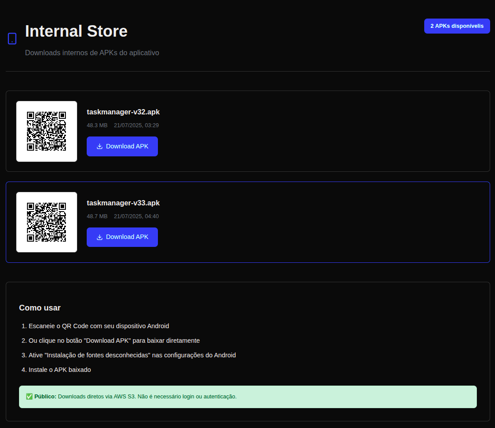
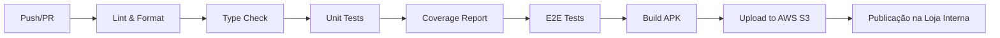
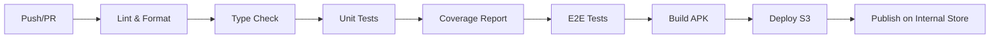

# TaskManager - React Native App

Um aplicativo de gerenciamento de tarefas desenvolvido em React Native com TypeScript para o desafio técnico da Capitani Grouṕ, seguindo princípios de arquitetura escalável e boas práticas de desenvolvimento.

## 🎯 Visão Geral
Além do desafio principal — criar uma aplicação funcional para gerenciamento de tarefas — este projeto propõe um fluxo completo de CI/CD voltado para times pequenos, com foco em distribuição interna de builds.

A aplicação foi pensada para cenários em que não se quer (ou não se pode) depender das lojas oficiais (Google Play ou App Store) para testes. Por isso, todo o processo de entrega contínua foi estruturado para entregar versões assinadas automaticamente em uma loja interna personalizada.

📲 A versão mais recente do APK está disponível para download via link direto ou QR Code na loja:

## 🔗 Loja Interna - TaskManager

📸 Visual da Loja Interna



## 🔄 CI/CD Pipeline
O projeto implementa um pipeline de CI/CD robusto usando GitHub Actions, garantindo qualidade e automação em todos os estágios de desenvolvimento.

🧩 Estrutura do Pipeline



## ⚙️ Etapas Explicadas
1. Validação (validate)
Executa yarn lint, yarn type-check e yarn test --coverage

Gera artefato com o relatório de cobertura

Garante que o código está limpo e seguro antes de avançar

2. Testes E2E com Maestro (e2e-maestro)
Instala o CLI do Maestro

Roda cenários de uso completos simulando o fluxo do usuário

Salva os relatórios dos testes como artefatos

3. Build e Distribuição (build-android)
Prepara o ambiente Android (Node.js, Java, SDK)
[Nessa etapa optamos por focar na entrega do apk android por não estar com um MAC disponivel para teste]

Baixa o keystore seguro da AWS S3 e configura as variáveis de assinatura

Gera o bundle JS e compila o APK (assembleRelease)

Faz o upload do APK:

Para o bucket S3 (rodrigo-apk-store)

Como artifact no GitHub (com versionamento via github.run_number)

## ✅ Benefícios
Distribuição Ágil: sem esperar publicação nas lojas

Ambiente Controlado: ideal para QAs, devs ou usuários selecionados

Segurança e Versionamento: builds assinados com controle de versão

Interface Simples: com download via botão ou QR Code para facilitar o acesso em dispositivos reais


## 🏗️ Decisões Arquiteturais

### Por que esta configuração?

A escolha das tecnologias e configurações foi baseada em requisitos específicos de qualidade, escalabilidade e experiência do desenvolvedor(DX) além da necessidade de demostrar conhecimentos em CICD:

#### **React Native + TypeScript**
- **Type Safety**: TypeScript oferece verificação de tipos em tempo de compilação, reduzindo bugs em runtime
- **Manutenibilidade**: Código mais legível e auto-documentado
- **Escalabilidade**: Facilita a manutenção em projetos grandes

#### **ESLint + Prettier**
- **Consistência**: Garante padrões de código uniformes em toda a equipe
- **Qualidade**: Identifica problemas potenciais antes da execução
- **Automação**: Formatação automática elimina debates sobre estilo de código
- **Integração**: Configurado com Husky para verificação pré-commit

#### **Jest + Testing Library**
- **Cobertura**: Testes unitários abrangentes
- **Confiança**: Refatoração segura com testes automatizados
- **Documentação**: Testes servem como documentação do comportamento
- **Qualidade**: Reduz regressões e bugs em produção

#### **Maestro E2E Testing**
- **Testes End-to-End**: Validação completa do fluxo do usuário
- **Automação**: Testes automatizados para cenários críticos
- **Confiança**: Garantia de que as funcionalidades principais funcionam
- **Eficiência**: Reduz testes manuais repetitivos

## 🏛️ Arquitetura Híbrida: Escalabilidade e Organização

### Estruturando para Escalabilidade: Uma Abordagem Arquitetural Híbrida

À medida que uma aplicação cresce, uma estrutura de pastas simples como `components` e `screens` torna-se muito dificil de controlar, levando a um acoplamento indesejado e dificuldade de manutenção. Para evitar isso, foi adotada uma **arquitetura híbrida** que combina três padrões poderosos:

#### **1. Arquitetura Baseada em Funcionalidades (Feature-Based)**
O código é organizado por **domínio de negócio** (por exemplo, `tasks`, `auth`) em vez de por tipo técnico. Esta é a principal estratégia organizacional, promovendo:
- **Encapsulamento**: Cada funcionalidade é autocontida
- **Escalabilidade**: Fácil adição de novas funcionalidades
- **Manutenibilidade**: Mudanças isoladas por domínio
- **Colaboração**: Equipes podem trabalhar em funcionalidades independentes

#### **2. Clean Architecture**
Dentro de cada funcionalidade, os princípios da Clean Architecture são aplicados para separar as responsabilidades em camadas distintas:
- **Camada de Apresentação/UI**: Componentes React e telas
- **Camada de Domínio**: Lógica de negócio (reducers, useCases)
- **Camada de Dados**: Gerenciamento de estado/contexto

#### **3. Atomic Design**
Os componentes de UI são estruturados seguindo uma hierarquia clara:
- **Átomos**: Blocos de construção mais básicos (Button, Input, StatusCard)
- **Moléculas**: Combinações de átomos (AddTaskForm, TaskItem)
- **Organismos**: Seções completas da UI (TaskScreen, DashboardScreen)

Esta abordagem híbrida oferece:
- **Organização em macro-nível** (funcionalidades)
- **Separação lógica** (camadas)
- **Consistência de UI** em micro-nível (componentes atômicos)

## 📁 Estrutura de Diretórios

```
TaskManager/
├── src/
│   ├── App.tsx                             # Ponto de entrada da aplicação
│   ├── features/                           # 🎯 Funcionalidades (Feature-Based)
│   │   └── tasks/                          # Domínio de Tarefas
│   │       ├── components/                 # 🧩 Componentes UI (Atomic Design)
│   │       │   ├── atoms/                  # Àtomos: componentes básicos
│   │       │   │   ├── CustomButton.tsx
│   │       │   │   └── StatusCard.tsx
│   │       │   └── molecules/              # Moléculas: combinações de átomos
│   │       │       ├── AddTaskForm.tsx
│   │       │       ├── TaskItem.tsx
│   │       │       ├── TaskList.tsx
│   │       │       └── TaskActions.tsx
│   │       ├── screens/                    # 🖥️ Organismos: telas completas
│   │       │   ├── DashBoardScreen.tsx
│   │       │   └── TaskScreen.tsx
│   │       └── context/                    # 🧠 Camada de Dados (Clean Architecture)
│   │           ├── TaskContext.tsx
│   │           └── taskReducer.ts
│   ├── navigation/                         # 🧭 Navegação da aplicação
│   │   └── AppNavigator.tsx
│   ├── types/                              # 📝 Definições de tipos TypeScript
│   │   └── task.ts
│   └── core/                               # 🔧 Utilitários e configurações globais
├── __tests__/                              # 🧪 Testes unitários
├── maestro/                                # 🎭 Testes E2E
├── android/                                # 🤖 Configurações Android
├── ios/                                    # 🍎 Configurações iOS
└── [configurações do projeto]
```

### 📊 Hierarquia de Componentes (Atomic Design)

```
Átomos (Atoms)
├── CustomButton     # Botão reutilizável
└── StatusCard       # Card de status

Moléculas (Molecules)
├── AddTaskForm      # Formulário de adição (Button + Input)
├── TaskItem         # Item de tarefa (Button + Text + Status)
├── TaskList         # Lista de tarefas (múltiplos TaskItem)
└── TaskActions      # Ações de tarefas (múltiplos Button)

Organismos (Organisms)
├── DashBoardScreen  # Tela principal (StatusCards + TaskActions)
└── TaskScreen       # Tela de tarefas (AddTaskForm + TaskList)
```

## 🔄 CI/CD Pipeline

O projeto implementa um pipeline de CI/CD robusto usando GitHub Actions, garantindo qualidade e automação em todos os estágios de desenvolvimento:

### Pipeline de Qualidade


### Etapas do Pipeline

#### **1. Validação (validate)**
- **Lint & Format**: Verificação de padrões de código com ESLint/Prettier
- **Type Check**: Validação rigorosa de tipos TypeScript
- **Unit Tests**: Execução completa da suíte de testes com cobertura
- **Coverage Report**: Geração e upload de relatório de cobertura

#### **2. Testes E2E (e2e-maestro)**
- **Maestro Tests**: Execução automatizada de testes end-to-end
- **Validação Funcional**: Verificação de fluxos críticos do usuário
- **Report Upload**: Armazenamento de relatórios de teste

#### **3. Build Android (build-android)**
- **Environment Setup**: Configuração de Node.js, Java e Android SDK
- **Keystore Security**: Download seguro de keystore via AWS S3
- **Bundle Generation**: Criação otimizada do bundle JavaScript
- **APK Build**: Compilação de APK release assinado
- **Artifact Management**: Upload para S3 e GitHub Artifacts

### Recursos de Segurança
- **Secrets Management**: Credenciais seguras via GitHub Secrets
- **AWS Integration**: Upload automatizado para S3
- **Versioning**: APKs versionados por número de build
- **Retention Policy**: Artifacts mantidos por 30 dias

## 🚀 Como Executar

### Pré-requisitos
- Node.js (v20+)
- React Native CLI
- Android Studio / Xcode
- Maestro CLI (para testes E2E)

### Instalação
```bash
# Clonar o repositório
git clone https://github.com/narradorww/TaskManager.git
cd TaskManager

# Instalar dependências
yarn install

# iOS (macOS apenas)
cd ios && pod install && cd ..

# Android
# Certifique-se de ter um emulador Android rodando
```

### Executar o Projeto
```bash
# Iniciar Metro bundler
yarn start

# Android
yarn run android

# iOS
yarn run ios
```

## 🧪 Testes

### Testes Unitários
```bash
# Executar todos os testes
yarn test

# Executar com watch mode
yarn test -- --watch

# Executar com coverage
yarn test -- --coverage
```

### Testes E2E (Maestro)

Este projeto utiliza o [Maestro](https://maestro.mobile.dev/) para testes end-to-end.

> **Atenção:** Os testes E2E funcionam apenas com seletores de texto, não utilize testIDs.

```bash
# Executar o teste E2E funcional
yarn run test:e2e
# ou diretamente
maestro test maestro/test.yaml
```

#### Troubleshooting Maestro
- Certifique-se de que o app está compilado com as últimas mudanças.
- Use sempre seletores de texto nos testes E2E.
- Se o teste falhar, rode novamente após recompilar o app.


### Qualidade de Código
```bash
# Linting
yarn run lint

# Formatação
yarn run format

# Verificar tipos TypeScript
yarn run type-check
```

## 📋 Funcionalidades

### ✅ Implementadas
- [x] Dashboard com resumo de tarefas
- [x] Adicionar novas tarefas
- [x] Marcar tarefas como concluídas
- [x] Listar tarefas pendentes e concluídas
- [x] Limpar tarefas concluídas
- [x] Persistência local com AsyncStorage
- [x] Navegação entre telas
- [x] Interface responsiva e acessível

### 🔄 Próximas Funcionalidades
- [ ] Categorização de tarefas (mukt-status)
- [ ] Filtros e busca
- [ ] Notificações
- [ ] Sincronização com backend
- [ ] Temas claro/escuro
- [ ] Animações e transições


## 🛠️ Tecnologias Utilizadas

### Core
- **React Native** - Framework mobile
- **TypeScript** - Linguagem tipada
- **React Navigation** - Navegação

### Estado e Dados
- **Context API** - Gerenciamento de estado
- **AsyncStorage** - Persistência local

### Qualidade e Testes
- **Jest** - Framework de testes
- **Testing Library** - Utilitários de teste
- **Maestro** - Testes E2E
- **ESLint** - Linting
- **Prettier** - Formatação

### DevOps & CI/CD
- **GitHub Actions** - Pipeline de CI/CD
- **AWS S3** - Armazenamento de artifacts
- **Husky** - Git hooks
- **Commitlint** - Padronização de commits

## 📈 Métricas de Qualidade

- **Cobertura de Testes**: 77/77 testes passando (100%)
- **Linting**: Zero erros de ESLint
- **TypeScript**: Verificação de tipos rigorosa
- **E2E**: Testes automatizados funcionais
- **CI/CD**: Pipeline automatizado com 3 etapas de validação

## 🤝 Contribuição

Para contribuir, siga as diretrizes detalhadas em [CONTRIBUTING.md](CONTRIBUTING.md).

## 📄 Licença

Este projeto está sob a licença MIT e foi criado como um Desafio de Teste. Veja o arquivo [LICENSE](LICENSE) para mais detalhes.

## 👥 Equipe

[Rodrigo Alexandre](mailto:rodrigo.anst@gmail.com)  
🌐 [rodrigoalexandre.dev](https://rodrigoalexandre.dev)  
🔗 [linkedin.com/in/rodrigoalexandre79](https://linkedin.com/in/rodrigoalexandre79)  
📩 [rodrigo.anst@gmail.com](mailto:rodrigo.anst@gmail.com)

---

**TaskManager** - Organize suas tarefas de forma eficiente e escalável! 🚀